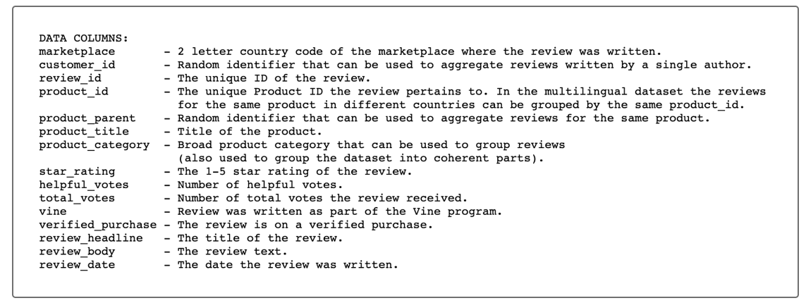
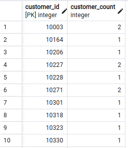
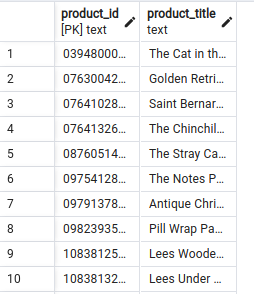
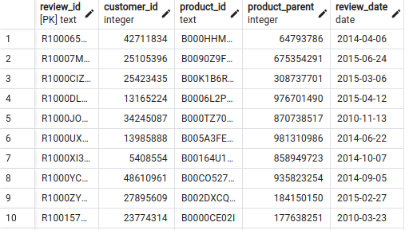
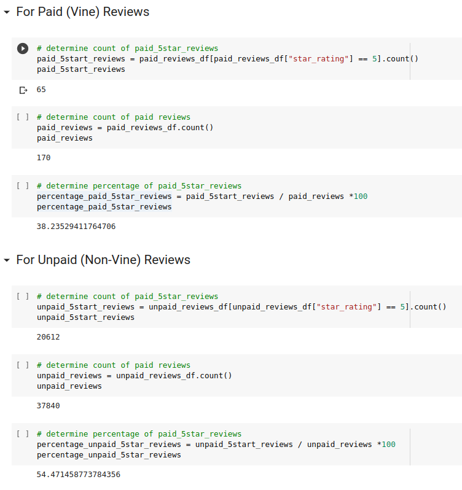

# Amazon_Vine_Analysis
Using PySpark to perform the ETL process, connect to AWS RDS instance and load transformed data into pgAdmin

## Background

### Overview of Analysis

This new assignment consists of two technical analysis deliverables and a written report. You will submit the following:

- Deliverable 1: Perform ETL on Amazon Product Reviews

- Deliverable 2: Determine Bias of Vine Reviews

- Deliverable 3: A Written Report on the Analysis (README.md)

### Purpose

To analize Amazon reviews written by members of the paid Amazon Vine program. The Amazon Vine program is a service that allows manufacturers and publishers to receive reviews for their products. Companies like SellBy pay a small fee to Amazon and provide products to Amazon Vine members, who are then required to publish a review.

In this project, we will choose 1 dataset from approximately 50 datasets. Then we will use PySpark to perform the ETL process to extract the dataset, transform the data, connect to an AWS RDS instance, and load the transformed data into pgAdmin. Then, use PySpark, Pandas, or SQL to determine if there is any bias toward favorable reviews from Vine members in your dataset. 

## Resources

Data source:

- (1) Amazon_Reviews_ETL_starter_code, (2) challenge_schema

Software:

- Google Colab, AWS RDS, pgAdmin 6.14, Visual Studio Code 1.71.2
 
 

## Methodology

 

We choosed an [Amazon_reviews_dataset](https://s3.amazonaws.com/amazon-reviews-pds/tsv/index.txt) to be analyzed. All the datasets had the same schemata, as shown in this image below:

(a)
 
 Figure (a) Amazon Dataset Example

 

### The customers_table DataFrame:

Created the customers_table, using the code in the Amazon_Reviews_ETL_starter_code.ipynb file and following the steps below to aggregate the reviews by customer_id.

- Used the groupby() function on the customer_id column of the DataFrame.

- Counted all the customer ids using the agg() function by chaining it to the groupby() function. After we used this function, a new column was created, count(customer_id).

- Rename the count(customer_id) column using the withColumnRenamed() function so it matches the schema for the customers_table in pgAdmin.

- The customers_table DataFrame should look like this:

(b)
 
 Figure (b) Customer ID Table

 

### The products_table DataFrame:

To create the products_table, we used the select() function to select the product_id and product_title, then droped duplicates with the drop_duplicates() function to retrieve only unique product_ids.

The final products_table DataFrame should look like this:

(c)
 
 Figure (c) Product ID Table

 

### The review_id_table DataFrame:

To create the review_id_table, we used the select() function to select the columns that are in the review_id_table in pgAdmin and convert the review_date column to a date.

The final review_id_table DataFrame should look like this:

(d)
 
 Figure (d) Review ID Table

 

### The vine_table DataFrame:

To create the vine_table, we used the select() function to select only the columns that are in the vine_table in pgAdmin

The final vine_table DataFrame should look like this:

(e)
 
 Figure (e) Vine Table

 

## Results

(f)
 
 Figure (f) Result analysis

 

- How many Vine reviews and non-Vine reviews were there?

    - There were 170 vine reviews and 37840 non_vine reviews

- How many Vine reviews were 5 stars? How many non-Vine reviews were 5 stars?

    - There were 65 5 star Vine reviews and 20612 5 star non-Vine reviews.

- What percentage of Vine reviews were 5 stars? What percentage of non-Vine reviews were 5 stars?

    - 38.24% of the 5 star reviews were Vine and 54.47% of 5 star reviews were non-ine.

## Summary

Ho: 5star_vine = 5star_not_vine (no difference in the percenage(proportion) of 5star ratings paid(vine) vs unpaid(not vine).

Ha: 5star_vine <> 5star_not_vine(there is a difference).

- percentage_5star_vine = **38.24%**
- percentage_5star_not_vine = **54.47%**
- **findings: the percentage of 5star rating is not the same when comparing vine reviewsto not_vine reviews.**
- **There is reason to believe that the percentage of 5star raitings is not directly tied to whether the review is paid or unpaid.**
- note: this hypothesis test would need to be evaluated comparing the proportion of 5star reviews among the two samples.

## References

[Markdown](https://docs.github.com/en/get-started/writing-on-github/getting-started-with-writing-and-formatting-on-github/basic-writing-and-formatting-syntax)

[Spark](https://downloads.apache.org/spark/)

